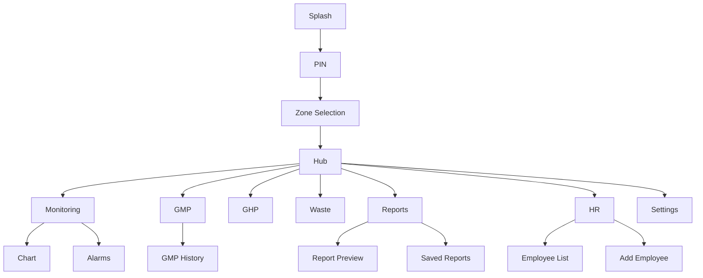

# HACCP Pilot - UI Description (UI/UX Only)
## Kiedy Dolaczac Ten Plik Do Konwersacji
- Gdy pracujesz nad ekranami, komponentami i interakcjami UX.
- Gdy ustalasz stany `loading/error/empty/success`.
- Gdy odwolujesz sie do numerow ekranow i `Stitch ID`.
- Gdy oceniasz dostepnosc i glove-friendly ergonomie.
- Nie dolaczaj do dyskusji o SQL/RLS/RPC i migracjach.

## 1. Zakres Dokumentu UI-only
Ten dokument opisuje wyłącznie warstwę wizualną i interakcje użytkownika.

Zakres:
- Layout ekranow, komponenty, stany, flow UX.
- Zasady czytelnosci i ergonomii (kiosk/glove-friendly).
- Zachowania interakcji na poziomie UI.

Poza zakresem:
- SQL, RLS, RPC, kontrakty migracji i security backend.
- Szczegoly implementacji repository/provider.

## 2. Globalne Zasady UX/UI i Design Tokens
### 2.1 Reguly globalne
| Regula | Wartosc |
|:--|:--|
| Min touch target | 60x60 dp |
| Styl pracy | Kiosk / glove-friendly |
| Typografia bazowa | Work Sans |
| Tryb | Dark-first |
| Krytyczne akcje | Long press dla akcji potwierdzajacych |
| Klawiatury | Preferowane kontrolki dedykowane (num pad, steppers, pickers) |

### 2.2 Palette i rytm UI
- Primary accent: miedziany/cieply akcent marki.
- Success: zielony semafor.
- Warning: zolty semafor.
- Error: czerwony semafor.
- Surface/background: ciemne tlo o wysokim kontraście tekstu.

### 2.3 Core zasady uzytecznosci
1. Jeden glowny CTA per ekran.
2. Wyrazne stany `loading`, `error`, `empty`, `success`.
3. Brak przeładowania treści: preferowane karty, sekcje, chipy statusowe.
4. Ujednolicone komunikaty i progres dla akcji krytycznych.

## 3. Komponenty Wspoldzielone UI (M09)
| Komponent | Rola UX |
|:--|:--|
| `HaccpTopBar` | Tytul + kontekst + nawigacja wstecz/wyloguj |
| `HaccpTile` | Nawigacja modułowa, badge, szybki skan |
| `HaccpLongPressButton` | Bezpieczne potwierdzenia akcji |
| `HaccpNumPad` | Wprowadzanie PIN/liczb bez klawiatury systemowej |
| `HaccpStepper` | Sterowanie wartościami liczbowymi |
| `HaccpDatePicker`/`HaccpTimePicker` | Czytelne wybory daty i czasu |
| `HaccpSuccessOverlay` | Krótkie potwierdzenie sukcesu |
| `HaccpEmptyState` | Komunikacja braku danych |
| `HaccpOfflineBanner` | Widoczna informacja o łączności |

### 3.1 Mapa Stitch: Numery Ekranow
| Screen | Nazwa | Stitch ID |
|:--|:--|:--|
| 1.1 | Splash / Branding | `bb89b45a89314b9a8899bcbc5e4354a3` |
| 1.2 | PIN Pad | `ea93036fd47e47ee983a97411bbee99a` |
| 1.3 | Wybór Strefy | `b208b776aee94143a96231a3095c553c` |
| Hub | Dashboard Hub | `cadac885417e4e1f992c409a2cef9585` |
| 2.1 | Dashboard Temperatur | `ab4c4dff668c467b9472733cf14a9761` |
| 2.2 | Wykres Historyczny | `43621479d33449a7b58a715e79781a58` |
| 2.3 | Panel Alarmów | `56527f23be1b406f85ca41c34abb94f7` |
| 3.1 | Wybór Procesu GMP | `10d3e0e2e68844f5be626042b1201c2b` |
| 3.2 | Formularz Pieczenie Mięs | `f74607ea977a41c3bceb5127548efb44` |
| 3.3 | Formularz Chłodzenie Żywności | `b7a4044e54cf448a80f6eebe499ed5f7` |
| 3.4 | Formularz Kontrola Dostaw | `0a4253be7f06423aa4ec6273cd82e539` |
| 3.5 | Historia Wpisów GMP | `ccc0814a7a904f419be06a96e0a4e0d5` |
| 4.1 | Wybór Kategorii Checklisty | `194f2f4ffccb4ed1b52efaee6ed602f5` |
| 4.2 | Checklista Personel | `14c0e64c15a743b180992b48c58ad845` |
| 4.3 | Checklista Pomieszczenia | `92b0da885ea14c4f85310b9a22a73245` |
| 4.4 | Checklista Konserwacja i Dezynfekcja | `88f8bfb8929f4945914047b85d254f6d` |
| 4.5 | Rejestr Środków Czystości | `ca10843ee23147d38755e01d1d24e4dd` |
| 4.6 | Historia Checklist | `fce15582b9644e17be1eb10f85e0b2ca` |
| 5.1 | Panel Odpadów | `990f275f86b2450ba6bdcc48aaf2fba2` |
| 5.2 | Formularz Rejestracji Odpadu | `45244139d51249d79b8ff7c24fe85a95` |
| 5.3 | Aparat Zdjęcie KPO | `b61818becfe748ea9e893cbb4e35f46c` |
| 5.4 | Historia Odpadów | `236157e708a841519d219926514a3b51` |
| 6.1 | Panel Raportów | `0646209242b54550b07182891b25ace8` |
| 6.1a | Generowanie Raportu Temperatury (Modal) | `-` |
| 6.1b | Generowanie Raportu CCP-3 (Automatyczne) | `-` |
| 6.2 | Podgląd Raportu CCP-3 | `8ad32c828e69495482c8a79600f6507b` (concept), `3f7251793f6948469e9a85c9c8d1b962` (design) |
| 6.3 | Status Google Drive | `18fc2d1117b94b368d63d02fc62fec59` |
| 7.1 | Dashboard HR | `9402903814f6427680d9cf071fe3d234` |
| 7.2 | Profil Pracownika | `8b028b4fdd3a4de794bd166b46d75b7d` |
| 7.3 | Dodaj Pracownika | `efe71cf586a04f429197b8d4b80762dd` |
| 7.4 | Lista Pracowników | `0f4529e4d77b4c9ba67fc8e1eeba3169` |
| 8.1 | Ustawienia Globalne | `7a43a321ebd84110b19cfceb434bf9ad` |
| 9.1 | Potwierdzenie Akcji (Success) | `12e6f4f60b48439ba0d03edb92227519` |
| 9.2 | Empty State | `de54bb7fedaf4a01a1b0ceab26429407` |
| 9.3 | Offline/Błąd Połączenia | `12b6c3d3d64e48bc888d45e483b17d15` |

## 4. Ekrany M01-M08 (Layout, Stany, Interakcje)

### M01 - Auth
#### 1. Splash
- Stitch ID: `bb89b45a89314b9a8899bcbc5e4354a3`
- Cel: branding + krótki start aplikacji.
- Layout: logo, nazwa lokalu/aplikacji, loader.
- Interakcje: brak (automatyczne przejście).

#### 2. PIN Pad
- Stitch ID: `ea93036fd47e47ee983a97411bbee99a`
- Cel: szybkie i bezpieczne logowanie kioskowe.
- Layout: header brandowy, pin dots, numpad, banner błędów.
- Interakcje: wpis PIN, backspace/clear, auto-submit po domknięciu PIN.
- Stany: idle/loading/error/lockout.

#### 3. Zone Selection
- Stitch ID: `b208b776aee94143a96231a3095c553c`
- Cel: wybór kontekstu pracy.
- Layout: top bar, lista/kafelki stref.
- Interakcje: tap strefy, powrót.

### Dashboard Hub
- Stitch ID: `cadac885417e4e1f992c409a2cef9585`
- Cel: centralna nawigacja do modułów.
- Layout: top bar, grid kafli, badge statusowe.
- Interakcje: wejście do M02-M08, wylogowanie.
- Widocznosc roli: HR/Settings tylko dla manager/owner.

### M02 - Monitoring
#### 1. Temperature Dashboard
- Stitch ID: `ab4c4dff668c467b9472733cf14a9761`
- Layout: lista kart sensorów, statusy i trendy.
- Interakcje: wejście w wykres i panel alarmów.
- Stany: normal/warning/critical oraz empty state.

#### 2. Sensor Chart
- Stitch ID: `43621479d33449a7b58a715e79781a58`
- Layout: tryby zakresów czasowych + widok tabelaryczny 7d.
- Interakcje: przełączanie zakresu, edycja dopuszczalnych rekordów.
- Stany: loading danych, brak danych, walidacja inputu.

#### 3. Alarms Panel
- Stitch ID: `56527f23be1b406f85ca41c34abb94f7`
- Layout: lista kart alarmowych z podziałem aktywne/historia.
- Interakcje: potwierdzenie alarmu przez long press.
- Stany: akcja per rekord, blokada duplikacji, empty per tab.

### M03 - GMP
- Stitch IDs: `3.1 10d3e0e2e68844f5be626042b1201c2b`, `3.2 f74607ea977a41c3bceb5127548efb44`, `3.3 b7a4044e54cf448a80f6eebe499ed5f7`, `3.4 0a4253be7f06423aa4ec6273cd82e539`, `3.5 ccc0814a7a904f419be06a96e0a4e0d5`
- Ekran wyboru procesu + formularze procesowe + historia wpisów.
- Interakcje: wypelnienie form, zapis, nawigacja do podglądu raportu z historii.
- UX: walidacje miękkie/twarde zależnie od pola i typu procesu.

### M04 - GHP
- Stitch IDs: `4.1 194f2f4ffccb4ed1b52efaee6ed602f5`, `4.2 14c0e64c15a743b180992b48c58ad845`, `4.3 92b0da885ea14c4f85310b9a22a73245`, `4.4 88f8bfb8929f4945914047b85d254f6d`, `4.5 ca10843ee23147d38755e01d1d24e4dd`, `4.6 fce15582b9644e17be1eb10f85e0b2ca`
- Ekran wyboru kategorii, checklisty, chemikalia, historia.
- Interakcje: toggles, komentarze, zapis checklist oraz wymagany wybor daty/godziny wykonania.
- Checklista `Personel`: wymagany dropdown `Pracownik`.
- Checklista `Pomieszczenia`: wymagany dropdown `Pomieszczenie`.
- UX: szybkie yes/no, czytelny feedback po zapisie, historia z filtrami (data/kategoria) i przejsciem do detalu wpisu.

### M05 - Waste
- Stitch IDs: `5.1 990f275f86b2450ba6bdcc48aaf2fba2`, `5.2 45244139d51249d79b8ff7c24fe85a95`, `5.3 b61818becfe748ea9e893cbb4e35f46c`, `5.4 236157e708a841519d219926514a3b51`
- Panel wpisów, formularz rejestracji, ekran aparatu, historia.
- Interakcje: dodanie wpisu, wykonanie zdjęcia, podgląd historii.
- UX: silny fokus na prostocie sekwencji kroków.

### M06 - Reports
- Stitch IDs: `6.1 0646209242b54550b07182891b25ace8`, `6.2 8ad32c828e69495482c8a79600f6507b/3f7251793f6948469e9a85c9c8d1b962`, `6.3 18fc2d1117b94b368d63d02fc62fec59`
- Panel wyboru raportu, preview, archiwum, status integracji.
- Interakcje: wybór miesiąca/zakresu, generacja, podgląd, ponowienie; archiwum oferuje akcje `PODGLAD` i `POBIERZ`.
- UX: jasny podział na generowanie, podgląd i historię.

### M07 - HR
- Stitch IDs: `7.1 9402903814f6427680d9cf071fe3d234`, `7.2 8b028b4fdd3a4de794bd166b46d75b7d`, `7.3 efe71cf586a04f429197b8d4b80762dd`, `7.4 0f4529e4d77b4c9ba67fc8e1eeba3169`
- Dashboard alertów personelu, lista, profil, dodawanie pracownika.
- Interakcje: szybkie przejścia do akcji kadrowych.
- UX: skondensowane status cards + listy krytycznych alertów.

### M08 - Settings
- Stitch ID: `7a43a321ebd84110b19cfceb434bf9ad`
- Ustawienia lokalu i zarządzanie produktami.
- `Zarzadzaj produktami` zawiera kategorie: `Chlodzenie`, `Obrobka termiczna`, `Ogolne`, `Pomieszczenia`.
- Interakcje: edycja pól, upload logo, zapis zmian, CRUD produktów.
- UX: jawne błędy, brak cichych porażek, klarowne CTA przy problemach.

## 5. Mapa Nawigacji Uzytkownika (Flow UX)

## 6. Accessibility i Glove-Friendly Checklist
1. Dotyk >= 60x60 dp dla kluczowych elementów.
2. Kontrast tekstu i statusów zgodny z ciemnym tłem.
3. Rozsądne wielkości fontów (czytelność z dystansu roboczego).
4. Błędy i ostrzeżenia zrozumiałe bez wiedzy technicznej.
5. Akcje krytyczne wymagają intencjonalnego gestu (long press).

## 7. Empty/Loading/Error/Success States Katalog
| State | Wzorzec UI | Cel |
|:--|:--|:--|
| Empty | `HaccpEmptyState` | Brak danych bez utraty kontekstu użytkownika |
| Loading | Skeleton/spinner lokalny lub ekranowy | Informacja o trwającej operacji |
| Error | Banner/snackbar/dialog z CTA | Umozliwienie korekty lub retry |
| Success | `HaccpSuccessOverlay` | Szybkie potwierdzenie poprawnej akcji |
| Offline | `HaccpOfflineBanner` | Transparentna degradacja funkcji online |

## 8. UI Changelog (Skondensowany, bez backend contracts)
### 2026-02-24
- M07: dashboard HR uproszczony do bardziej skanowalnego układu kart i krótkich list.
- M08: domknięte stany błędów i feedback zapisu.

### 2026-02-26
- CCP2/CCP3: ujednolicone flow preview i komunikaty empty state dla raportów miesięcznych.
- M01 PIN: redesign wizualny premium, z zachowaniem ergonomii kiosk.

### 2026-02-27
- M08: doprecyzowane walidacje formularza ustawień i rozdzielenie ścieżek błędów upload/save.
- M04: checklisty i chemia wymagają daty/godziny wykonania; historia GHP ma filtry i ekran detalu wpisu.
- M06: archiwum raportów rozszerzone o czytelne akcje `PODGLAD`/`POBIERZ` dla raportu GHP i pozostałych typów.

