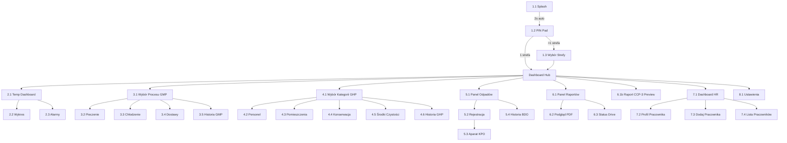

# HACCP Pilot v03-00 — UI Developer Specification

> **Cel dokumentu:** Szczegółowy opis każdego ekranu pod programowanie. Przyciski, akcje, nawigacja, walidacja, dane.
> **Źródło:** [UI.md](file:///c:/Users/HP/OneDrive%20-%20flowsforge.com/Projekty/HACCP%20Mięso%20i%20Piana/Up%20to%20date/UI.md) + [Gemini.MD.md](file:///c:/Users/HP/OneDrive%20-%20flowsforge.com/Projekty/HACCP%20Mięso%20i%20Piana/Up%20to%20date/Gemini.MD.md)
> **Tech Stack:** Flutter (Dart) + Supabase + Material 3

---

## Globalne Reguły Implementacji

| Reguła | Wartość | Uwagi |
|:-------|:--------|:------|
| Min Touch Target | 60×60 dp | Rękawiczki! Bezwzględne minimum 48×48 dp |
| Font | Work Sans | Google Fonts |
| Body Font Size | 18sp min | |
| Kolor OK | `#2E7D32` | |
| Kolor Alarm | `#C62828` | |
| Kolor Ostrzeżenie | `#F9A825` | |
| Kolor Akcent | `#D2661E` | Copper/Orange |
| Zaokrąglenia | 8dp | |
| Tryb | Dark Mode | Onyx/Charcoal tło |
| Long Press | 1 sekunda | Dla krytycznych akcji (Zapisz, Zatwierdź) |
| Klawiatury | BRAK systemowych | Używaj NumPad, Stepper, Toggle, Picker |

### Wspólne Komponenty (do zbudowania raz, użycia wszędzie)

1. **`HaccpTopBar`** — Tytuł ekranu, przycisk Back (← ikona), opcjonalnie: ikona akcji (search, filter)
2. **`HaccpStepper`** — Stepper (+/−) z dużymi przyciskami, konfigurowalny krok i min/max
3. **`HaccpToggle`** — Duży Toggle Switch (Zielony OK / Czerwony Problem), 60×36 dp min
4. **`HaccpTile`** — Kafelek nawigacyjny (ikona + label + badge/status)
5. **`HaccpLongPressButton`** — Przycisk wymagający przytrzymania 1s z progress indicator
6. **`HaccpTimePicker`** / **`HaccpDatePicker`** — Duże koła/kalendarze
7. **`HaccpNumPad`** — Klawiatura numeryczna 3×4, przyciski 80×80 dp
8. **`HaccpSuccessOverlay`** — Ekran 9.1 jako overlay (auto-dismiss 2s)
9. **`HaccpEmptyState`** — Ekran 9.2 jako widget wielokrotnego użytku
10. **`HaccpOfflineBanner`** — Ekran 9.3 jako banner/overlay

---

## M01 — Core & Login (Kiosk)

**Tabele Supabase:** `profiles`, `venues`
**Ścieżka Flutter:** `lib/features/m01_auth/`

---

### Ekran 1.1: Splash / Branding

**Stitch ID:** `bb89b45a89314b9a8899bcbc5e4354a3`
**Plik:** `splash_screen.dart`

#### Layout

| Element | Typ | Opis |
|:--------|:----|:-----|
| Tło | Container | Ciemny gradient + opcjonalny obraz restauracji (niska opacity) |
| Logo | Image/Text | "HACCP Pilot" — biały, wyśrodkowany |
| Subtitle | Text | "Mięso i Piana" — kolor `#D2661E` |
| Loader | CircularProgressIndicator | Kolor `#D2661E`, na dole |
| Wersja | Text | "v03-00" — prawy dolny róg, 12sp, szary |

#### Logika

- `initState()` → `Future.delayed(Duration(seconds: 2))` → `Navigator.pushReplacement(PinPadScreen)`
- Brak interakcji użytkownika (auto-transition)

#### Nawigacja

| Akcja | Cel |
|:------|:----|
| Auto (2s) | → **Ekran 1.2: PIN Pad** |

---

### Ekran 1.2: PIN Pad

**Stitch ID:** `ea93036fd47e47ee983a97411bbee99a`
**Plik:** `pin_pad_screen.dart`

#### Layout

| Element | Typ | Rozmiar | Opis |
|:--------|:----|:--------|:-----|
| Logo | Image | — | "HACCP Pilot" na górze |
| PIN Dots | Row of 4-6 Circles | 16dp each | Wypełnione = wpisane, puste = brakujące |
| Grid 0-9 | GridView 3×4 | 80×80 dp / button | Przyciski 0-9 |
| Kasuj | Button | 80×80 dp | Usuwa ostatnią cyfrę |
| Zaloguj | Button | Full width × 60dp | Kolor `#D2661E` |
| Error Banner | Container | Full width | Czerwony, "Błędny PIN", auto-hide 2s |
| Sanepid Banner | Container | Full width | Żółty `#F9A825`, "⚠️ Wymagane odnowienie badań" |

#### Logika

```dart
onDigitPressed(digit):
  pin += digit
  updateDots()

onClear():
  pin = pin.substring(0, pin.length - 1)
  updateDots()

onLogin():
  user = await supabase.rpc('verify_pin', params: {pin: pin})
  if (user == null):
    showError("Błędny PIN") → auto-clear after 2s
  else:
    checkSanepidStatus(user)
    if (user.venues.length > 1):
      navigate → Ekran 1.3
    else:
      navigate → Dashboard Hub
```

#### Walidacja

| Warunek | Akcja | Blokuje? |
|:--------|:------|:---------|
| PIN nieprawidłowy | Czerwony banner 2s + czyść pole | TAK |
| Badania Sanepid wygasły | Żółty banner na górze | **NIE** |

#### Nawigacja

| Akcja | Cel |
|:------|:----|
| Login OK + 1 strefa | → **Dashboard Hub** |
| Login OK + >1 strefa | → **Ekran 1.3: Wybór Strefy** |

---

### Ekran 1.3: Wybór Strefy

**Stitch ID:** `b208b776aee94143a96231a3095c553c`
**Plik:** `zone_selection_screen.dart`

#### Layout

| Element | Typ | Opis |
|:--------|:----|:-----|
| TopBar | HaccpTopBar | "Wybierz Strefę", Back → Ekran 1.2 |
| Welcome | Text | "Zalogowano jako: {user.name}" |
| Subtitle | Text | "Gdzie zaczynasz pracę?" |
| Grid | GridView 2×2 | Kafelki stref |

#### Kafelki Stref (dynamiczne z bazy)

| Kafelek | Ikona | Dane |
|:--------|:------|:-----|
| Kuchnia Gorąca | 👨‍🍳 | `venues.zones WHERE venue_id = current` |
| Mroźnia / Magazyn | ❄️ | j.w. |
| Bar / Sala | 🍺 | j.w. |
| Zmywak | 🧹 | j.w. |

#### Nawigacja

| Akcja | Cel |
|:------|:----|
| Tap Strefa | → **Dashboard Hub** (z `zone_id` w kontekście) |
| Back | → **Ekran 1.2: PIN Pad** |

---

## Dashboard Hub

**Stitch ID:** `cadac885417e4e1f992c409a2cef9585`
**Plik:** `dashboard_hub_screen.dart`
**Tabele:** Agregacja z wielu tabel

#### Layout

| Element | Typ | Opis |
|:--------|:----|:-----|
| TopBar | Custom | Nazwa lokalu + Nazwa użytkownika + Przycisk WYLOGUJ (czerwony) |
| Grid | GridView 2×4 | 7 kafelków modułów |

#### Kafelki (hardcoded nawigacja, dynamiczne statusy)

| # | Ikona | Label | Badge (dynamiczny) | Nawigacja → | Widoczność |
|:--|:------|:------|:--------------------|:------------|:-----------|
| 1 | 🌡️ | Monitoring Temperatur | "{n} alarmów" (z `measurements`) | → Ekran 2.1 | Wszyscy |
| 2 | 🍖 | Procesy GMP | "Dziś: {n} wpisów" (z `gmp_logs`) | → Ekran 3.1 | Wszyscy |
| 3 | 🧹 | Higiena GHP | "{n} do zrobienia" | → Ekran 4.1 | Wszyscy |
| 4 | ♻️ | Odpady BDO | "Dziś: {n}" (z `waste_records`) | → Ekran 5.1 | Wszyscy |
| 5 | 📊 | Raporty & Archiwum | "{n} niesynchr." | → Ekran 6.1 | Wszyscy |
| 6 | 👥 | HR & Personel | "{n} alertów" (z `profiles`) | → Ekran 7.1 | `manager`, `owner` |
| 7 | ⚙️ | Ustawienia | — | → Ekran 8.1 | `manager`, `owner` |

#### Przycisk WYLOGUJ

| Element | Typ | Akcja |
|:--------|:----|:------|
| Wyloguj | ElevatedButton | Kolor `#C62828`, potwierdź dialogiem → `supabase.auth.signOut()` → Ekran 1.2 |

---

## M02 — Monitoring Temperatur

**Tabele Supabase:** `measurements`, `devices`
**Ścieżka Flutter:** `lib/features/m02_monitoring/`

---

### Ekran 2.1: Dashboard Temperatur

**Stitch ID:** `ab4c4dff668c467b9472733cf14a9761`
**Plik:** `temperature_dashboard_screen.dart`

#### Layout

| Element | Typ | Opis |
|:--------|:----|:-----|
| TopBar | HaccpTopBar | "{zona_name}", Back → Hub |
| DateTime | Text | Aktualna data/godzina (odświeżana co 1 min) |
| SensorList | ListView | Karty sensorów |

#### Karta Sensora (powtarzany komponent)

| Element | Typ | Opis |
|:--------|:----|:-----|
| Nazwa | Text 18sp | np. "Chłodnia #1" |
| Temperatura | Text **36sp+** | Wartość °C, kolor dynamiczny |
| Timestamp | Text 14sp | "Ostatni pomiar: 10:15" |
| Interwał | Chip | "Co 15 min" lub "⚡ Co 5 min" |
| Trend | Icon | ↑ (rosnący), ↓ (malejący), → (stabilny) |

#### Logika Kolorów Temperatury (Algorytm 10/5/3)

```text
if (temp <= 10):
  color = GREEN (#2E7D32)
  interval = 15 min
elif (temp > 10 AND consecutiveAbove10 < 3):
  color = YELLOW (#F9A825)
  interval = 5 min    // ZMIANA!
elif (consecutiveAbove10 >= 3):
  color = RED (#C62828) + alarm_icon
  interval = 5 min
  triggerAlarm()       // SMS + Push
```

#### Dane (Supabase Realtime)

```sql
SELECT d.name, m.temperature, m.measured_at, d.interval_minutes
FROM devices d
JOIN measurements m ON m.device_id = d.id
WHERE d.zone_id = :current_zone_id
ORDER BY m.measured_at DESC
LIMIT 1 PER device
```

#### Empty State Handling

Jeśli w wybranej strefie nie ma żadnych aktywnych sensorów (np. nowa strefa), wyświetlany jest centralny komunikat:

- **Widget**: `HaccpEmptyState` (z M09) lub `Center(Text)`
- **Komunikat**: "Brak aktywnych sensorów w tej strefie"
- **Priorytet**: Wyświetlane zamiast listy sensorów.

#### Nawigacja

| Akcja | Cel |
|:------|:----|
| Tap karta sensora | → **Ekran 2.2: Wykres** (z `device_id`) |
| Ikona alarmu (TopBar) | → **Ekran 2.3: Panel Alarmów** |
| Back | → **Dashboard Hub** |

---

### Ekran 2.2: Wykres Historyczny

**Stitch ID:** `43621479d33449a7b58a715e79781a58`
**Plik:** `sensor_chart_screen.dart`

#### Layout

| Element | Typ | Opis |
|:--------|:----|:-----|
| TopBar | HaccpTopBar | "{sensor_name}", Back → Ekran 2.1 |
| Chart | LineChart (fl_chart) | Oś X = czas, Oś Y = temp |
| ThresholdLine | HorizontalLine | Czerwona przerywana na 10°C |
| Annotations | Markers on chart | Etykiety (Dostawa, Mycie itp.) |
| FilterChips | Row | "24h" / "7 dni" / "30 dni" |
| AddAnnotation | FloatingActionButton | "+ Adnotacja" |

#### Filtrowanie Czasowe

| Chip | Zakres danych | Query |
|:-----|:--------------|:------|
| 24h (default) | `measured_at > NOW() - INTERVAL '24 hours'` | |
| 7 dni | `measured_at > NOW() - INTERVAL '7 days'` | |
| 30 dni | `measured_at > NOW() - INTERVAL '30 days'` | |

#### Modal "Dodaj Adnotację"

| Element | Typ | Opis |
|:--------|:----|:-----|
| Quick Labels | Chips | "Dostawa", "Defrost", "Mycie", "Inne" |
| Custom Text | TextField | Opcjonalny komentarz (KLAWIATURA OK tutaj — managera) |
| Zapisz | HaccpLongPressButton | INSERT INTO `annotations` |

#### Nawigacja

| Akcja | Cel |
|:------|:----|
| Back | → **Ekran 2.1** |

---

### Ekran 2.3: Panel Alarmów

**Stitch ID:** `56527f23be1b406f85ca41c34abb94f7`
**Plik:** `alarms_panel_screen.dart`

#### Layout

| Element | Typ | Opis |
|:--------|:----|:-----|
| TopBar | HaccpTopBar | "Alarmy", Back → Ekran 2.1 |
| Tabs | TabBar | "Aktywne" / "Historia" |
| AlarmList | ListView | Karty alarmów |

#### Karta Alarmu

| Element | Typ | Opis |
|:--------|:----|:-----|
| Sensor | Text bold | Nazwa sensora |
| Temperatura | Text 24sp RED | Aktualna wartość |
| Czas trwania | Text | "Od: 10:15 (45 min)" |
| Potwierdź | HaccpLongPressButton | "Przyjąłem do wiadomości" (Long Press 1s) |

#### Logika "Przyjąłem do wiadomości"

```dart
onLongPressComplete():
  await measurementsRepository.acknowledgeAlert(alarm.id, currentUser.id);
  // UPDATE temperature_logs SET is_acknowledged = true, acknowledged_by = user.id
  showSnackBar("Potwierdzono")
```

#### Nawigacja

| Akcja | Cel |
|:------|:----|
| Back | → **Ekran 2.1** |

---

## M03 — Procesy GMP (Produkcja)

**Tabele Supabase:** `gmp_logs`
**Ścieżka Flutter:** `lib/features/m03_gmp/`

---

### Ekran 3.1: Wybór Procesu

**Stitch ID:** `10d3e0e2e68844f5be626042b1201c2b`
**Plik:** `gmp_process_selector_screen.dart`

#### Layout

| Element | Typ | Opis |
|:--------|:----|:-----|
| TopBar | HaccpTopBar | "Procesy GMP", Back → Hub |
| Tiles | Column of 3 HaccpTile | Full width |

#### Kafelki

| # | Ikona | Label | Badge | Nawigacja → |
|:--|:------|:------|:------|:------------|
| 1 | 🥩 | Pieczenie Mięs | "Dziś: {n}" | → Ekran 3.2 |
| 2 | ❄️ | Chłodzenie Żywności | "Dziś: {n}" | → Ekran 3.3 |
| 3 | 🚚 | Kontrola Dostaw | "Dziś: {n}" | → Ekran 3.4 |

#### Badge Query

```sql
SELECT COUNT(*) FROM gmp_logs
WHERE process_type = :type
AND DATE(created_at) = CURRENT_DATE
AND zone_id = :current_zone_id
```

---

### Ekran 3.2: Formularz — Pieczenie Mięs

**Stitch ID:** `f74607ea977a41c3bceb5127548efb44`
**Plik:** `meat_roasting_form_screen.dart`

#### Pola Formularza

| # | Label | Typ kontrolki | Walidacja | Default |
|:--|:------|:-------------|:----------|:--------|
| 1 | Produkt | Dropdown (duże pozycje) | Required | — |
| 2 | Nr Partii | NumPad input | Required | — |
| 3 | Temp. Nastawy Pieca [°C] | HaccpStepper | Range: 50-300 | 180°C, krok 5 |
| 4 | Czas Start | HaccpTimePicker | Required | Now() |
| 5 | Czas Stop | HaccpTimePicker | > Czas Start | — |
| 6 | Temp. Wewnętrzna [°C] | HaccpStepper | Range: 0-200 | 75°C, krok 1 |

#### Walidacja Miękka (NON-BLOCKING!)

| Warunek | Komunikat | Kolor |
|:--------|:----------|:------|
| Temp. Wewnętrzna < 75°C | "⚠️ Temperatura poniżej zalecanego minimum 75°C" | `#F9A825` |

> **WAŻNE:** Walidacja NIE blokuje zapisu! Użytkownik może zapisać mimo ostrzeżenia (Gemini.MD §5D).

#### Przycisk Zapisz

| Element | Typ | Kolor | Akcja |
|:--------|:----|:------|:------|
| Zapisz | HaccpLongPressButton | `#2E7D32` | Long Press 1s → INSERT `gmp_logs` → Ekran 9.1 (Success) |

#### Nawigacja

| Akcja | Cel |
|:------|:----|
| Back | → **Ekran 3.1** |
| Zapisz OK | → **Ekran 9.1** (overlay 2s) → **Ekran 3.1** |

---

### Ekran 3.3: Formularz — Chłodzenie Żywności

**Stitch ID:** `b7a4044e54cf448a80f6eebe499ed5f7`
**Plik:** `food_cooling_form_screen.dart`

#### Pola Formularza

| # | Label | Typ kontrolki | Walidacja | Default |
|:--|:------|:-------------|:----------|:--------|
| 1 | Produkt | Dropdown | Required | — |
| 2 | Data Przygotowania | HaccpDatePicker | Required | Today |
| 3 | Godzina Rozpoczęcia | HaccpTimePicker | Required | Now() |
| 4 | Godzina Zakończenia | HaccpTimePicker | > Start | — |
| 5 | Wartość temperatury [°C] | HaccpStepper | Range: -10 to 100 | 4°C, krok 0.1 |
| 6 | Zgodność zkryteriami | HaccpToggle | Required | — |
| 7 | Działania korygujące | TextField | Opcjonalne | — |

#### Walidacja Miękka

| Warunek | Komunikat |
|:--------|:----------|
| Temp. po 2h ≥ 21°C | "⚠️ Temperatura po 2h powinna być poniżej 21°C" |
| Temp. Końcowa ≥ 4°C | "⚠️ Temperatura końcowa powinna być poniżej 4°C" |

#### Zapisz → identycznie jak 3.2

---

### Ekran 3.4: Formularz — Kontrola Dostaw

**Stitch ID:** `0a4253be7f06423aa4ec6273cd82e539`
**Plik:** `delivery_control_form_screen.dart`

#### Pola Formularza

| # | Label | Typ kontrolki | Walidacja | Default |
|:--|:------|:-------------|:----------|:--------|
| 1 | Dostawca | Dropdown / TextField | Required | — |
| 2 | Nr WZ/Faktury | TextField | Required | — |
| 3 | Temp. Transportu [°C] | HaccpStepper | Range: -30 to 30 | 4°C, krok 1 |
| 4 | Stan Opakowań | 2 × HaccpTile | **Required** | — |
| 5 | Data Ważności | HaccpDatePicker | Required | — |
| 6 | Weryfikacja Szkodników | 2 × HaccpTile | **Required!** | — |

#### Stan Opakowań (Binary Tiles)

| Kafelek | Kolor | Wartość |
|:--------|:------|:--------|
| ✅ OK | `#2E7D32` | `packaging_ok = true` |
| ❌ Uszkodzone | `#C62828` | `packaging_ok = false` |

#### Weryfikacja Szkodników (Binary Tiles)

| Kafelek | Kolor | Wartość |
|:--------|:------|:--------|
| ✅ Brak | `#2E7D32` | `pests_detected = false` |
| ❌ Wykryto | `#C62828` | `pests_detected = true` |

#### Zapisz → identycznie jak 3.2

---

### Ekran 3.5: Historia Wpisów GMP

**Stitch ID:** `ccc0814a7a904f419be06a96e0a4e0d5`
**Plik:** `gmp_history_screen.dart`

#### Layout

| Element | Typ | Opis |
|:--------|:----|:-----|
| TopBar | HaccpTopBar | "Historia GMP", Back → Ekran 3.1 |
| Filters | Row | Dropdown "Typ procesu" + DateRange picker |
| List | ListView | Karty wpisów |

#### Karta Wpisu

| Element | Typ | Opis |
|:--------|:----|:-----|
| Data | Text bold | dd.MM.yyyy HH:mm |
| Proces | Chip | "Pieczenie" / "Chłodzenie" / "Dostawa" |
| Produkt | Text | Nazwa produktu |
| Status | Icon | ✅ OK (zielony) / ⚠️ Ostrzeżenie (żółty) |

#### Query

```sql
SELECT * FROM gmp_logs
WHERE zone_id = :zone_id
AND (:process_type IS NULL OR process_type = :process_type)
AND created_at BETWEEN :date_from AND :date_to
ORDER BY created_at DESC
```

#### Nawigacja (Update v04)

| Akcja | Cel |
|:------|:----|
| Back | → **Ekran 3.1** |
| Tap "Schładzanie" | → **Ekran 6.2: Podgląd Raportu CCP-3** |

| Akcja | Cel |
|:------|:----|
| Back | → **Ekran 3.1** |

---

## M04 — Higiena GHP (Checklisty)

**Tabele Supabase:** `ghp_logs`
**Ścieżka Flutter:** `lib/features/m04_ghp/`

---

### Ekran 4.1: Wybór Kategorii Checklisty

**Stitch ID:** `194f2f4ffccb4ed1b52efaee6ed602f5`
**Plik:** `ghp_category_selector_screen.dart`

#### Kafelki

| # | Ikona | Label | Nawigacja → |
|:--|:------|:------|:------------|
| 1 | 👤 | Personel | → Ekran 4.2 |
| 2 | 🏠 | Pomieszczenia | → Ekran 4.3 |
| 3 | 🔧 | Konserwacja & Dezynfekcja | → Ekran 4.4 |
| 4 | 🧴 | Środki Czystości | → Ekran 4.5 |

#### Nawigacja dodatkowa

| Akcja | Cel |
|:------|:----|
| Ikona Historia (TopBar) | → **Ekran 4.6** |
| Back | → **Dashboard Hub** |

---

### Ekran 4.2: Checklista — Personel

**Stitch ID:** `14c0e64c15a743b180992b48c58ad845`
**Plik:** `ghp_personnel_checklist_screen.dart`

#### Layout

| Element | Typ | Opis |
|:--------|:----|:-----|
| TopBar | HaccpTopBar | "Higiena Personelu", Back → 4.1 |
| EmployeeName | Text 20sp bold | Imię i nazwisko pracownika |
| CheckItems | ListView | Lista punktów kontrolnych |
| Submit | HaccpLongPressButton | "Zatwierdź Checklistę" |

#### Punkty Kontrolne (hardcoded items)

| # | Label | Kontrolka | Logika |
|:--|:------|:----------|:-------|
| 1 | Czysty ubiór roboczy | HaccpToggle | default: null |
| 2 | Brak biżuterii | HaccpToggle | default: null |
| 3 | Włosy osłonięte (czepek/siatka) | HaccpToggle | default: null |
| 4 | Ręce umyte i zdezynfekowane | HaccpToggle | default: null |

#### Logika Toggle → Komentarz

```dart
onToggleChanged(item, value):
  if (value == false):  // Czerwony = Problem
    showCommentField(item)  // AnimatedContainer expand
  else:
    hideCommentField(item)
```

#### Submit

```
onLongPressComplete():
  await supabase.from('ghp_logs').insert({
    category: 'personnel',
    employee_id: selectedEmployee.id,
    zone_id: currentZone.id,
    items: checklistItems.toJson(),
    approved_by: currentUser.id,
    created_at: DateTime.now()
  })
  showSuccessOverlay()  // Ekran 9.1
```

---

### Ekran 4.3: Checklista — Pomieszczenia

**Stitch ID:** `92b0da885ea14c4f85310b9a22a73245`
**Plik:** `ghp_rooms_checklist_screen.dart`

#### Punkty Kontrolne

| # | Label | Kontrolka |
|:--|:------|:----------|
| 1 | Czystość podłóg | HaccpToggle |
| 2 | Czystość blatów roboczych | HaccpToggle |
| 3 | Kosze opróżnione | HaccpToggle |
| 4 | Zlew / umywalka czyste | HaccpToggle |

#### Logika identyczna jak Ekran 4.2 (`category: 'rooms'`)

---

### Ekran 4.4: Checklista — Konserwacja & Dezynfekcja

**Stitch ID:** `88f8bfb8929f4945914047b85d254f6d`
**Plik:** `ghp_maintenance_checklist_screen.dart`

#### Punkty Kontrolne (dynamiczne z bazy urządzeń)

| # | Label | Kontrolka | Dodatkowe |
|:--|:------|:----------|:----------|
| 1 | Piec konwekcyjny | HaccpToggle | "Ostatnie mycie: {date}" |
| 2 | Chłodnia #1 | HaccpToggle | "Ostatnie mycie: {date}" |
| 3 | Chłodnia #2 | HaccpToggle | "Ostatnie mycie: {date}" |
| 4 | Frytownica | HaccpToggle | "Ostatnie mycie: {date}" |
| 5 | Toster/Grill | HaccpToggle | "Ostatnie mycie: {date}" |
| 6 | Termomix | HaccpToggle | "Ostatnie mycie: {date}" |
| 7 | Zmywarka | HaccpToggle | "Ostatnie mycie: {date}" |

#### Logika identyczna jak 4.2 (`category: 'maintenance'`)

---

### Ekran 4.5: Rejestr Środków Czystości

**Stitch ID:** `ca10843ee23147d38755e01d1d24e4dd`
**Plik:** `ghp_chemicals_registry_screen.dart`

#### Layout

| Element | Typ | Opis |
|:--------|:----|:-----|
| TopBar | HaccpTopBar | "Środki Czystości", Back → 4.1 |
| Form | Column | Formularz rejestracji |
| TodayList | ListView | Dzisiejsze wpisy (pod formularzem) |

#### Pola Formularza

| # | Label | Typ kontrolki | Default |
|:--|:------|:-------------|:--------|
| 1 | Nazwa środka | Dropdown / TextField | — |
| 2 | Ilość / Stężenie | HaccpStepper | 1.0, krok 0.5 |
| 3 | Przeznaczenie | Dropdown | Options: Podłogi, Blaty, Sprzęt, Ręce |

#### Zapisz → INSERT `ghp_logs` (`category: 'chemicals'`) → Success overlay

---

### Ekran 4.6: Historia Checklist

**Stitch ID:** `fce15582b9644e17be1eb10f85e0b2ca`
**Plik:** `ghp_history_screen.dart`

#### Layout

| Element | Typ | Opis |
|:--------|:----|:-----|
| TopBar | HaccpTopBar | "Historia Checklist", Back → 4.1 |
| Filters | Row | Dropdown "Kategoria" + DateRange |
| List | ListView | Karty historii |

#### Karta Historii

| Element | Opis |
|:--------|:-----|
| Data | dd.MM.yyyy HH:mm |
| Kategoria | Chip (Personel / Pomieszczenia / Konserwacja / Środki) |
| Status | ✅ Zgodny / ❌ Niezgodny |
| Zatwierdzający | Imię osoby |

---

## M05 — Odpady BDO

**Tabele Supabase:** `waste_records`
**Storage:** Supabase Storage (`/waste-docs/{venue_id}/{rok}/{miesiąc}/{dzień}/`)
**Ścieżka Flutter:** `lib/features/m05_waste/`

---

### Ekran 5.1: Panel Odpadów

**Stitch ID:** `990f275f86b2450ba6bdcc48aaf2fba2`
**Plik:** `waste_panel_screen.dart`

#### Layout

| Element | Typ | Opis |
|:--------|:----|:-----|
| TopBar | HaccpTopBar | "Odpady BDO", Back → Hub |
| MainButton | ElevatedButton | "+ Zarejestruj Odpad", Full width, Kolor `#D2661E` |
| RecentList | ListView | Ostatnie wpisy (karty) |

#### Karta Wpisu Odpadu

| Element | Typ | Opis |
|:--------|:----|:-----|
| Rodzaj | Text bold | Potoczna nazwa + kod BDO w nawiasie |
| Masa | Text | "{n} kg" |
| Data | Text 14sp | dd.MM.yyyy |
| Miniatura | Image 60×60 | Podgląd z Storage (jeśli jest) |
| Status | Chip | "Zarejestrowany" (żółty) / "Odebrany" (zielony) |

#### Nawigacja

| Akcja | Cel |
|:------|:----|
| "+ Zarejestruj Odpad" | → **Ekran 5.2** |
| Tap karta | → Szczegóły (read-only) |
| Ikona Historia (TopBar) | → **Ekran 5.4** |
| Back | → **Dashboard Hub** |

---

### Ekran 5.2: Formularz Rejestracji Odpadu

**Stitch ID:** `45244139d51249d79b8ff7c24fe85a95`
**Plik:** `waste_registration_form_screen.dart`

#### Pola Formularza

| # | Label | Typ kontrolki | Walidacja | Default |
|:--|:------|:-------------|:----------|:--------|
| 1 | Rodzaj odpadu | HaccpTile (5 kafelków) | Required | — |
| 2 | Masa [kg] | HaccpStepper | Required, > 0 | 0.5 kg, krok 0.5 |
| 3 | Firma Odbierająca | Dropdown | Required | — |
| 4 | Nr KPO | TextField | Opcjonalny | — |
| 5 | Zdjęcie KPO | ImageButton | Opcjonalny | — |

#### Kafelki Rodzaju Odpadu (auto-mapowanie kodów BDO)

| Kafelek | Kod BDO | Wartość w DB |
|:--------|:--------|:-------------|
| 🛢️ Zużyty olej/frytura | 20 01 25 | `used_oil` |
| 🍖 Resztki jedzenia | 20 01 08 | `food_waste` |
| 📦 Opakowania plastikowe | 15 01 02 | `plastic_packaging` |
| 📄 Opakowania papierowe | 15 01 01 | `paper_packaging` |
| ❓ Inne | Pole ręczne | `other` + custom code |

#### Przycisk "Zdjęcie KPO"

| Akcja | Cel |
|:------|:----|
| Tap "Dodaj Zdjęcie" | → **Ekran 5.3** (Camera) |

#### Zapisz → INSERT `waste_records` → Success overlay

---

### Ekran 5.3: Aparat — Zdjęcie KPO

**Stitch ID:** `b61818becfe748ea9e893cbb4e35f46c`
**Plik:** `waste_camera_screen.dart`

#### Layout

| Element | Typ | Opis |
|:--------|:----|:-----|
| Preview | CameraPreview | Pełnoekranowy podgląd |
| Shutter | FloatingActionButton | 80dp, ikona aparatu |
| After Capture: Photo | Image | Podgląd zdjęcia |
| After Capture: Retry | Button | "Ponów" → wraca do Preview |
| After Capture: Confirm | HaccpLongPressButton | "Zatwierdź" → Upload |
| UploadBar | LinearProgressIndicator | Postęp uploadu |

#### Logika Upload

```
onConfirm():
  path = '/waste-docs/${venue_id}/${year}/${month}/${day}/${timestamp}.jpg'
  await supabase.storage.from('waste-docs').upload(path, imageBytes)
  photoUrl = supabase.storage.from('waste-docs').getPublicUrl(path)
  Navigator.pop(context, photoUrl)  // Zwraca URL do formularza 5.2
```

#### Nawigacja

| Akcja | Cel |
|:------|:----|
| Zatwierdź | → **Ekran 5.2** (z URL zdjęcia) |
| Ponów | → Reset Preview |
| Back | → **Ekran 5.2** (bez zdjęcia) |

---

### Ekran 5.4: Historia Odpadów

**Stitch ID:** `236157e708a841519d219926514a3b51`
**Plik:** `waste_history_screen.dart`

#### Layout

| Element | Typ | Opis |
|:--------|:----|:-----|
| TopBar | HaccpTopBar | "Historia Odpadów", Back → 5.1 |
| Filters | Row | Dropdown "Miesiąc" + Dropdown "Rodzaj odpadu" |
| Summary | Text | "Łącznie: {n} kg" (suma mas za okres) |
| List | ListView | Karty z miniaturami |

---

## M06 — Raportowanie & Archiwum

**Tabele Supabase:** Agregacja SQL z wielu tabel
**Integracje:** Google Drive API
**Ścieżka Flutter:** `lib/features/m06_reports/`

---

### Ekran 6.1: Panel Raportów

**Stitch ID:** `0646209242b54550b07182891b25ace8`
**Plik:** `reports_panel_screen.dart`

#### Layout — Sekcja "Generuj Raport"

| Element | Typ | Opis |
|:--------|:----|:-----|
| DateRange | HaccpDatePicker (range) | Domyślnie: wczoraj |
| ReportType | Column of Chips | 5 typów raportów |
| Generate | ElevatedButton | "Generuj PDF", kolor `#D2661E` |

#### Typy Raportów

| Chip | Ikona | Opis |
|:-----|:------|:-----|
| 📋 Raport Dzienny | — | Agregacja wszystkich modułów za dzień |
| 🌡️ Raport Temperatur | — | Dane z `measurements` |
| 🧹 Raport Higieny GHP | — | Dane z `ghp_logs` |
| 🍖 Raport Procesów GMP | — | Dane z `gmp_logs` |
| ♻️ Raport BDO | — | Dane z `waste_records` |
| ❄️ Raport CCP-3 | — | Arkusz monitorowania chłodzenia (Nowy!) |

#### Layout — Sekcja "Ostatnie Raporty"

| Element | Typ | Opis |
|:--------|:----|:-----|
| List | ListView | Karty raportów |

#### Karta Raportu

| Element | Typ | Opis |
|:--------|:----|:-----|
| Nazwa + Data | Text | "Raport Dzienny — 12.02.2026" |
| Sync Status | Chip | 🟢 Zsync / 🟡 Oczekuje / 🔴 Błąd |
| Podgląd | Button | → **Ekran 6.2** |
| Udostępnij | Button | → Email share dialog |
| Ponów sync | Button (tylko przy 🔴) | Retry upload do Drive |

#### Nawigacja

| Akcja | Cel |
|:------|:----|
| "Generuj PDF" | → Generowanie w tle → dodanie do listy |
| "Podgląd PDF" | → **Ekran 6.2** |
| Status Drive (TopBar) | → **Ekran 6.3** |
| Back | → **Dashboard Hub** |

---

### Ekran 6.1a: Generowanie Raportu Temperatury (Modal)

**Plik:** `reports_panel_screen.dart` (MonthYearPicker + SensorSelector)

#### Layout

| Element | Typ | Opis |
|:--------|:----|:-----|
| Nagłówek | Text | "Wybierz miesiąc" / "Wybierz urządzenie" |
| Selektor Miesiąca | Custom Widget | Siatka 12 miesięcy, nawigacja roku, ciemne tło (`AppTheme.surface`), wyraźne białe napisy |
| Selektor Urządzenia | ModalBottomSheet | Lista dostępnych sensorów z bazy lub opcja "Wszystkie" |
| Akcja | Button | Generuj Raport (HTML → PDF) |

#### Szablon Raportu (HTML)

Raport generowany jest jako dokument HTML stylizowany CSS `@media print` na format A4.

**Sekcje Raportu:**

1. **Nagłówek:** Logo/Nazwa lokalu, Data generowania, Użytkownik.
2. **Podsumowanie (Karty):**
   - Liczba dni pomiarowych
   - Całkowita liczba odczytów
   - Min / Max temperatura w miesiącu
   - Liczba alarmów (na czerwono jeśli > 0)
3. **Tabela Szczegółowa:**
   - Kolumny: Data, Urządzenie, Min, Max, Średnia, Status (OK/ALARM)
   - Wiersze: Agregacja dzienna per urządzenie
   - Kolorowanie statusów: Zielony (norma) / Czerwony (krytyczne)
4. **Stopka:** Data wydruku, podpis systemu.

---

### Ekran 6.1b: Generowanie Raportu CCP-3 (Automatyczne)

**Trigger:** Zapis formularza "Chłodzenie Żywności" (Ekran 3.3).

#### Wygląd Raportu (Mockup)


**Struktura:**

1. **Nagłówek:** Dane lokalu, Tytuł "Arkusz monitorowania CCP-3".
2. **Sekcja Limitów (3 kolorowe boksy):**
   - 🟢 Wartość docelowa: 20°C w 2h
   - 🟡 Tolerancja: +10°C
   - 🔴 Wartość krytyczna: 30°C
3. **Tabela Danych:**
   - Data/Godz rozpoczęcia
   - Produkt (np. "Pierogi")
   - Godz. koniec
   - Temp. (2h)
   - Zgodność (TAK/NIE - automatyczne)
   - Działania korygujące (z pola "Uwagi")
   - Podpis (Użytkownik)

---

### Ekran 6.2: Podgląd Raportu CCP-3

**Stitch ID:** `8ad32c828e69495482c8a79600f6507b` (Concept) / `3f7251793f6948469e9a85c9c8d1b962` (Report Design)
**Plik:** `ccp3_preview_screen.dart`

#### Layout

| Element | Typ | Opis |
|:--------|:----|:-----|
| TopBar | HaccpTopBar | "Podgląd Raportu CCP-3", Back → 6.1 |
| DebugBar | Container (Green) | Pasek diagnostyczny: "PDF załadowany: {bytes} bajtów" + Przycisk "Pobierz" |
| PDFViewer | SfPdfViewer.memory | Wbudowany przeglądnik PDF |

#### Przyciski

| Przycisk | Ikona | Akcja |
|:---------|:------|:------|
| Pobierz (DebugBar) | ⬇️ | Wymusza pobranie pliku PDF (`file_opener`) |
| Back | ← | Powrót do formularza |

> [!NOTE]
> Ekran obsługuje automatyczne pobieranie/cache'owanie raportu jeśli został już wygenerowany tego dnia.

---

### Ekran 6.3: Status Google Drive

**Stitch ID:** `18fc2d1117b94b368d63d02fc62fec59`
**Plik:** `drive_status_screen.dart`

#### Layout

| Element | Typ | Opis |
|:--------|:----|:-----|
| TopBar | HaccpTopBar | "Google Drive", Back → 6.1 |
| Connection | Card | Status połączenia z kontem serwisowym |
| FolderStructure | Tree/List | `Archiwum HACCP / {Lokal} / {Rok} / {Miesiąc}` |
| LastSync | Text | "Ostatnia synchronizacja: {datetime}" |
| SyncNow | ElevatedButton | "Synchronizuj teraz", kolor `#D2661E` |

---

## M07 — HR & Personel (Manager)

**Tabele Supabase:** `profiles`
**Ścieżka Flutter:** `lib/features/m07_hr/`
**Dostęp:** Tylko `manager` i `owner`!

---

### Ekran 7.1: Dashboard HR

**Stitch ID:** `9402903814f6427680d9cf071fe3d234`
**Plik:** `hr_dashboard_screen.dart`

#### Layout

| Element | Typ | Opis |
|:--------|:----|:-----|
| TopBar | HaccpTopBar | "HR & Personel", Back → Hub, Ikona "+" → 7.3, Ikona List → 7.4 |
| AlertCards | HorizontalListView | Karty alertów 3 kategorie |

#### Sekcje Alertów

| Sekcja | Kolor tła | Warunek | Dane |
|:-------|:----------|:--------|:-----|
| 🔴 Przeterminowane | `#C62828` (20% opacity) | `sanepid_expiry < TODAY` | Lista pracowników |
| 🟡 Wygasają ≤30 dni | `#F9A825` (20% opacity) | `sanepid_expiry BETWEEN TODAY AND TODAY+30` | Lista |
| 🟢 Ważne | `#2E7D32` (20% opacity) | `sanepid_expiry > TODAY+30` | Tylko liczba |

#### Karta Pracownika (w alertach)

| Element | Opis |
|:--------|:-----|
| Imię | Text bold |
| Stanowisko | Text |
| Data wygaśnięcia | Text |
| Dni do wygaśnięcia | Badge (np. "-5 dni" / "14 dni") |

#### Nawigacja

| Akcja | Cel |
|:------|:----|
| Tap karta pracownika | → **Ekran 7.2** (z `employee_id`) |
| Ikona "+" (TopBar) | → **Ekran 7.3** |
| Ikona Lista (TopBar) | → **Ekran 7.4** |
| Back | → **Dashboard Hub** |

---

### Ekran 7.2: Profil Pracownika

**Stitch ID:** `8b028b4fdd3a4de794bd166b46d75b7d`
**Plik:** `employee_profile_screen.dart`

#### Layout

| Element | Typ | Opis |
|:--------|:----|:-----|
| TopBar | HaccpTopBar | "{employee_name}", Back → 7.1 |
| BasicInfo | Card | Imię, Rola, Lokal/Strefa |
| SanepidSection | Card | Badania Sanepid |
| ActivitySection | Card | Aktywność |
| StatusToggle | Card | Aktywny/Nieaktywny |

#### Sekcja Badania Sanepid

| Element | Typ | Akcja |
|:--------|:----|:------|
| Data ważności | Text | Display |
| Skan dokumentu | Image thumbnail 100×80 | Tap → Pełny podgląd (modal) |
| Aktualizuj badania | ElevatedButton | → Dialog z DatePicker + Camera/Gallery |

#### Sekcja Aktywność

| Element | Opis |
|:--------|:-----|
| Ostatnie logowania | Lista 5 ostatnich (data + godzina) |
| Checklists ten tydzień | Liczba (np. "7 checklist") |

#### Toggle Status

| Element | Typ | Opis |
|:--------|:----|:-----|
| Aktywny/Nieaktywny | HaccpToggle | `profiles.is_active` — dezaktywacja ≠ usunięcie! |

---

### Ekran 7.3: Dodaj Pracownika

**Stitch ID:** `efe71cf586a04f429197b8d4b80762dd`
**Plik:** `add_employee_screen.dart`

#### Pola Formularza

| # | Label | Typ kontrolki | Walidacja |
|:--|:------|:-------------|:----------|
| 1 | Imię i nazwisko | TextField | Required |
| 2 | Rola | 2 × HaccpTile | "Pracownik" / "Manager" |
| 3 | Kod PIN | HaccpNumPad | 4-6 cyfr, unikalne |
| 4 | Potwierdź PIN | HaccpNumPad | Musi = pole 3 |
| 5 | Lokal | Dropdown | Required |
| 6 | Strefa domyślna | Dropdown (zależny od 5) | Required |
| 7 | Data badań Sanepid | HaccpDatePicker | Required |
| 8 | Skan badań | Camera/Gallery Button | Opcjonalny |

#### Zapisz → INSERT `profiles` → Success → Ekran 7.4

---

### Ekran 7.4: Lista Pracowników

**Stitch ID:** `0f4529e4d77b4c9ba67fc8e1eeba3169`
**Plik:** `employee_list_screen.dart`

#### Layout

| Element | Typ | Opis |
|:--------|:----|:-----|
| TopBar | HaccpTopBar | "Pracownicy ({count})", Search icon, Back → 7.1 |
| FilterChips | HorizontalScroll | "Wszyscy" / "Aktywni" / "Wygasające Badania" / "Nieaktywni" |
| List | ListView | Karty pracowników |

#### Karta Pracownika

| Element | Typ | Opis |
|:--------|:----|:-----|
| Imię | Text bold | |
| Rola | Text 14sp | np. "Kucharz" |
| Status Sanepid | StatusDot + Text | 🟢 OK / 🟡 14 dni / 🔴 Wygasło! |
| Edytuj | TextButton | → **Ekran 7.2** |

#### Filtrowanie

```sql
-- Wszyscy
SELECT * FROM profiles WHERE venue_id = :venue_id

-- Aktywni
SELECT * FROM profiles WHERE is_active = true

-- Wygasające Badania
SELECT * FROM profiles WHERE sanepid_expiry BETWEEN TODAY AND TODAY + 30

-- Nieaktywni
SELECT * FROM profiles WHERE is_active = false
```

---

## M08 — Ustawienia Globalne

**Ścieżka Flutter:** `lib/features/m08_settings/`
**Dostęp:** Tylko `manager` i `owner`!

---

### Ekran 8.1: Ustawienia Globalne

**Stitch ID:** `7a43a321ebd84110b19cfceb434bf9ad`
**Plik:** `global_settings_screen.dart`

#### Sekcja 1: Sensory Temperatury

| Element | Typ | Opcje/Range |
|:--------|:----|:------------|
| Interwał Pomiaru | SegmentedControl | 5 min / 15 min / 60 min |
| Powiadomienia Push | HaccpToggle | true/false |
| Próg Alarmowy (Chłodnia) | HaccpStepper | Default: 8°C, range: 0-15, krok 1 |

#### Sekcja 2: Interfejs

| Element | Typ | Akcja |
|:--------|:----|:------|
| Tryb Ciemny | HaccpToggle | Zmiana ThemeMode |
| Dźwięki Systemowe | Slider | Range: 0-100 |

#### Sekcja 3: Dane Lokalu

| Element | Typ | Opis |
|:--------|:----|:-----|
| Nazwa | TextField | "Mięso i Piana" |
| Adres | TextField | "ul. Przykładowa 1" |

#### Przycisk

| Element | Typ | Akcja |
|:--------|:----|:------|
| Zapisz Ustawienia | HaccpLongPressButton | UPDATE `venues` (`name`, `nip`, `address`, `logo_url`, `temp_interval`, `temp_threshold`) → Success overlay |

#### Nawigacja

| Akcja | Cel |
|:------|:----|
| Back | → **Dashboard Hub** |

---

## M09 — UX Polish (Feedback & States)

**Ścieżka Flutter:** `lib/core/widgets/`
**Uwaga:** Te ekrany to **komponenty wielokrotnego użytku**, nie osobne strony!

---

### Ekran 9.1: Potwierdzenie Akcji (Success)

**Stitch ID:** `12e6f4f60b48439ba0d03edb92227519`
**Plik:** `success_overlay.dart`
**Typ:** `OverlayWidget` (nie Route!)

#### Implementacja

```dart
class HaccpSuccessOverlay extends StatelessWidget {
  final String message;      // Default: "Zadanie Wykonane!"
  final String submessage;   // Default: "Twoje zgłoszenie zostało zapisane."
  final Duration duration;   // Default: 2 seconds

  // Wyświetlany jako showDialog / Overlay
  // Auto-dismiss po `duration`
  // Animacja: scale up → pulse → fade out
}
```

#### Użycie

```dart
await HaccpSuccessOverlay.show(context);
Navigator.pop(context); // Wróć do poprzedniego ekranu
```

---

### Ekran 9.2: Empty State

**Stitch ID:** `de54bb7fedaf4a01a1b0ceab26429407`
**Plik:** `empty_state_widget.dart`
**Typ:** `Widget` (wstawiany w ListView gdy items.isEmpty)

#### Implementacja

```dart
class HaccpEmptyState extends StatelessWidget {
  final String headline;     // Default: "Wszystko Zrobione!"
  final String subtext;      // Default: "Brak nowych zadań na dziś."
  final String buttonLabel;  // Default: "Wróć do Pulpitu"
  final VoidCallback onButtonPressed;
}
```

#### Gdzie używać

- Ekran 2.3 (gdy brak alarmów)
- Ekran 3.5 (gdy brak wpisów GMP za dzień)
- Ekran 4.6 (gdy brak historii checklist)
- Ekran 5.4 (gdy brak wpisów odpadów)

---

### Ekran 9.3: Offline / Błąd Połączenia

**Stitch ID:** `12b6c3d3d64e48bc888d45e483b17d15`
**Plik:** `offline_screen.dart`
**Typ:** Pełnoekranowy overlay LUB banner na górze ekranu

#### Layout

| Element | Typ | Opis |
|:--------|:----|:-----|
| Icon | SvgIcon | Cloud z przekreśleniem / WiFi off |
| Headline | Text 24sp | "Brak Połączenia" |
| Subtext | Text 16sp | "Nie martw się! Twoje dane są bezpieczne..." |
| Primary | ElevatedButton | "Spróbuj Ponownie" → `connectivity.check()` |
| Secondary | OutlinedButton | "Pracuj Offline" → dismiss overlay |

#### Logika

```dart
// Nasłuchiwanie stanu sieci
connectivity.onConnectivityChanged.listen((status) {
  if (status == ConnectivityResult.none) {
    showOfflineOverlay();
  } else {
    hideOfflineOverlay();
    syncPendingData();  // Wyślij dane zebrane offline
  }
});
```

---

## Mapa Nawigacji (Podsumowanie)



---

## Aktualizacja implementacyjna M07 UI (2026-02-24)

### Ekran 7.1: Dashboard HR (zmiana realizacji)

Plik: `lib/features/m07_hr/screens/hr_dashboard_screen.dart`

Zmieniono uklad z ciezkich, wysokich kart alertow na uklad kompaktowy:
- 3 male karty statusu: `Przeterminowane`, `Wygasaja <=30d`, `Wazne`,
- 2 sekcje listowe alertow (`Krytyczne alerty`, `Wygasaja wkrotce`) z limitem pozycji i CTA `Zobacz wszystkie`,
- stale szybkie akcje na dole sekcji (`Lista`, `Dodaj`).

Cel zmiany:
- usuniecie efektu "rozciagnietych kafelkow" blokujacych widok,
- lepszy skan ekranu na desktop i tablet w realnym trybie kiosk.

### Ekran 7.3: Dodaj Pracownika (stabilizacja UX)

Plik: `lib/features/m07_hr/screens/add_employee_screen.dart`

Wprowadzone poprawki:
- lock przycisku zapisu podczas `loading` (brak duplikacji submit),
- czytelne komunikaty bledow domenowych RPC,
- filtrowanie widocznych stref do aktualnego kontekstu lokalu,
- stabilniejsze zachowanie modalu PIN i walidacji przed zapisem.

### Ekran 7.2: Profil Pracownika (techniczna zmiana sciezki)

Plik: `lib/features/m07_hr/screens/employee_profile_screen.dart`

Zmiana PIN wykonywana jest teraz przez RPC `update_employee_pin` (backend contract), bez bezposredniego update tabeli `employees` z klienta.

---

## Aktualizacja implementacyjna M08 UI (2026-02-24)

### Ekran 8.1: Ustawienia Globalne (stabilizacja i UX)

Plik: `lib/features/m08_settings/screens/global_settings_screen.dart`

Wprowadzone poprawki:
- usuniety nieskonczony loader przy braku kontekstu strefy,
- jawny error state z akcjami:
  - `Wybierz strefe` -> `/zone-select`
  - `Powrot do Hub` -> `/hub`
- zapis ustawien zakonczony przez `HaccpSuccessOverlay` (M09),
- czytelne komunikaty bledow domenowych (RLS/constraint),
- walidacja NIP (dokladnie 10 cyfr),
- sekcja `System` oznaczona jako lokalna (bez zapisu do DB).

### Ekran 8.1: Kontrakt zapisu danych

Akcja przycisku `Zapisz Ustawienia`:
- UPDATE tabeli `venues` (nie `venue_settings`)
- pola:
  - `name`
  - `nip`
  - `address`
  - `logo_url`
  - `temp_interval`
  - `temp_threshold`

### Ekran 8.1a: Zarzadzanie produktami

Plik: `lib/features/m08_settings/screens/manage_products_screen.dart`

Zmiany:
- empty state przez `HaccpEmptyState`,
- walidacja nazwy produktu i deduplikacja przed zapisem,
- brak fallbackowych danych testowych w UI,
- obsluga bledow RLS i constraint w komunikatach dla operatora.

### Dostep rolowy

Routing (`app_router.dart`):
- `/settings` i `/settings/products` dostepne tylko dla `manager` / `owner`.
- `cook` / `cleaner` otrzymuja przekierowanie do `Dashboard Hub`.

## Aktualizacja CCP2 (2026-02-26)

Zmiany UX/UI dla przeplywu CCP2:

- Ekran podgladu CCP2 (Ccp2PreviewScreen) dziala na okresie miesiecznym, zgodnie z selektorem miesiaca w panelu raportow.
- Komunikaty empty-state dla CCP2 odnosza sie do wybranego miesiaca (nie dnia).
- Dla formularza pieczenia, gdy Zgodnosc z ustaleniami = NIE, pole Dzialania korygujace jest traktowane jako wymagane i blokuje zapis do czasu uzupelnienia.
- Podglad PDF CCP2 wykorzystuje dane lokalu pobrane z DB (nazwa/adres), co usuwa hardcoded naglowek.

