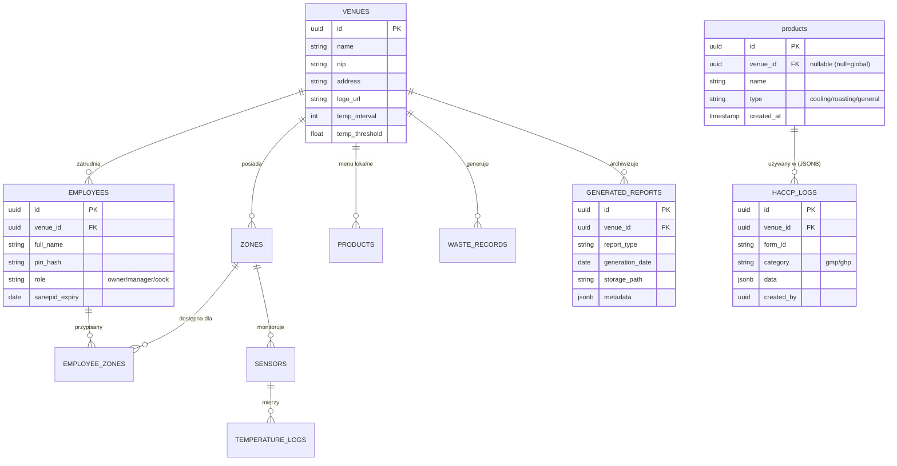

# Dokumentacja Bazy Danych (Supabase)

Dokument opisuje aktualny stan bazy danych projektu HACCP Pilot, relacje między tabelami oraz powiązania z modułami aplikacji. Stan na: **Luty 2026**.

> **Źródła:**
>
> - [Code_description.MD](Code_description.MD) (Opis architektury)
> - Pliki migracyjne SQL (`*_create_*.sql`, `*_update_*.sql`)

---

## 1. Schemat Relacyjny (ERD)

---

## 2. Szczegółowy Opis Tabel

### 2.1 Konfiguracja i Struktura (`venues`, `zones`, `employees`)

| Tabela | Kolumna | Typ | Opis |
|:---|:---|:---|:---|
| **`venues`** | `id` | UUID (PK) | Unikalny identyfikator lokalu. |
| | `name` | TEXT | Nazwa lokalu (np. "Restauracja U Jana"). |
| | `nip` | TEXT | Numer NIP. |
| | `logo_url` | TEXT | URL do logo w Storage (`branding`). |
| | `temp_interval` | INT | Częstotliwość pomiarów IoT (minuty). |
| **`employees`** | `id` | UUID (PK) | ID pracownika. |
| | `venue_id` | UUID (FK) | Powiązanie z lokalem. |
| | `pin_hash` | TEXT | Hash SHA-256 kodu PIN (4 cyfry). |
| | `role` | TEXT | Rola: `owner`, `manager` lub `cook`. |
| **`zones`** | `id` | UUID (PK) | ID strefy (np. Kuchnia, Magazyn). |
| | `venue_id` | UUID (FK) | Powiązanie z lokalem. |

### 2.2 Produkty i Procesy (`products`, `haccp_logs`)

| Tabela | Kolumna | Typ | Opis |
| :--- | :--- | :--- | :--- |
| **`products`** | `id` | UUID (PK) | ID produktu. |
| | `venue_id` | UUID (FK) | Jeśli `NULL` -> Produkt Globalny (widoczny wszędzie). Jeśli podane -> Produkt Lokalny (tylko dla tego `venue`). |
| | `name` | TEXT | Nazwa potrawy/produktu. Unikalna w obrębie lokalu (`UNIQUE NULLS NOT DISTINCT (name, venue_id)`). |
| | `type` | TEXT | Typ: `cooling`, `roasting`, `general`. |
| **`haccp_logs`** | `id` | UUID (PK) | ID wpisu loga. |
| | `venue_id` | UUID (FK) | Powiązanie z lokalem (kluczowe do filtracji danych i RLS). |
| | `zone_id` | UUID (FK) | Powiązanie ze strefą (np. Kuchnia). |
| | `category` | TEXT | `gmp` (formularze) lub `ghp` (checklisty). |
| | `form_id` | TEXT | ID formularza, np. `food_cooling`. |
| | `data` | JSONB | Pełne dane wpisu (dynamiczna struktura formularza). |
| | `user_id` | UUID (FK) | ID pracownika (`employees`), który wykonał czynność. |
| | `created_by` | UUID (FK) | ID użytkownika Supabase Auth (techniczne). |

### 2.3 Monitoring IoT (`sensors`, `temperature_logs`)

| Tabela | Kolumna | Typ | Opis |
|:---|:---|:---|:---|
| **`sensors`** | `id` | UUID (PK) | ID czujnika. |
| | `mac_address` | TEXT | Adres fizyczny urządzenia BLE. |
| | `zone_id` | UUID (FK) | Strefa, w której znajduje się czujnik. |
| **`temperature_logs`** | `temperature` | FLOAT | Odczyt temperatury. |
| | `recorded_at` | TIMESTAMPTZ | Czas pomiaru. |

### 2.4 Raporty i Archiwizacja (`generated_reports`)

| Tabela | Kolumna | Typ | Opis |
|:---|:---|:---|:---|
| **`generated_reports`** | `storage_path` | TEXT | Ścieżka do pliku PDF w buckecie `reports`. |
| | `report_type` | TEXT | Typ raportu, np. `ccp3_cooling`. |
| | `generation_date` | DATE | Data, której dotyczy raport. |

---

## 3. Relacje i Powiązania Modułów

Tabela przedstawia, które moduły (M01-M08) korzystają z których tabel (CRUD).

| Moduł | Główna Tabela | Tabele Pomocnicze | Uprawnienia (Zazwyczaj) |
|:---|:---|:---|:---|
| **M01 Auth** | `employees` | `zones`, `employee_zones` | Read (RPC `login_with_pin`) |
| **M02 IoT** | `temperature_logs` | `sensors`, `zones` | Read (Realtime Subscription) |
| **M03 GMP** | `haccp_logs` | `products` | Insert (Log), Read (History, List Products) |
| **M04 GHP** | `haccp_logs` | - | Insert (Log), Read (History) |
| **M05 Waste** | `waste_records` | - | Insert, Read |
| **M06 Reports** | `generated_reports` | `haccp_logs` (source), `temperature_logs` (source) | Read, Insert (PDF generation) |
| **M07 HR** | `employees` | `employee_zones` | CRUD (Manager Only) |
| **M08 Settings** | `venues` | `products`, `sensors` | Update (Venue), CRUD (Products) |

---

1. **Polityki Bezpieczeństwa (RLS)**

Bezpieczeństwo opiera się na Row Level Security. Aplikacja nie korzysta ze standardowego logowania Supabase Auth (email/pass), lecz z własnego mechanizmu opartego na PIN.

1. **Uwierzytelnianie:**
    - Użytkownik podaje PIN (4 cyfry).
    - Aplikacja woła funkcję RPC `login_with_pin(venue_nip, pin)`.
    - Funkcja zwraca token JWT (z `role: authenticated`) oraz dane pracownika.
    - **Ważne**: Tabela `employees` jest chroniona (SELECT tylko dla `authenticated`).

2. **Izolacja Danych (Multi-tenancy):**
    - Większość tabel (`products`, `haccp_logs`, `generated_reports`) posiada kolumnę `venue_id`.
    - Docelowa polityka: `USING (venue_id = (select venue_id from employees where id = auth.uid()))`.
    - **Faza Pilot (Aktualnie)**:
        - `haccp_logs`: `USING (true)` / `CHECK (true)` (Uproszczone dla testów, filtracja w aplikacji).
        - `products`: `USING (true)` (Odczyt globalny).

3. **Role:**
    - Kolumna `role` w `employees` (`owner`, `manager`, `cook`) steruje dostępem do ekranów w aplikacji (Guardy).

---

## 5. Uwagi do Plików Źródłowych

Analiza plików źródłowych wykazała zgodność, z małymi wyjątkami:

- **`Code_description.MD`**: Jest najbardziej aktualny (Luty 2026).
- **`00_Architecture_Master_Plan.md`**: Opisuje plan z 15.02.2026. Struktura jest poprawna, ale szczegóły tabeli `products` (kolumna `venue_id` do multi-tenancy) zostały doprecyzowane w sprincie 5 (SQL `32_update_products_table.sql`). Dokumentacja `supabase.md` uwzględnia ten nowszy stan.
