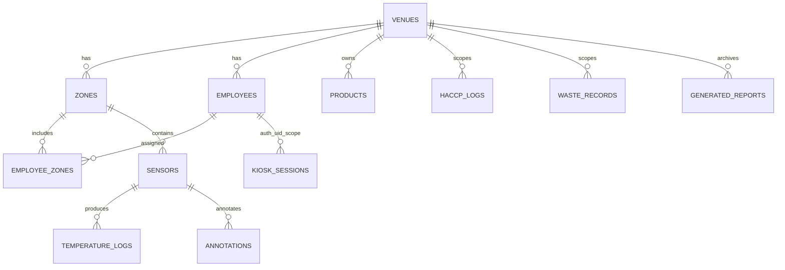

# Supabase Documentation (Data Layer Only)
## Kiedy Dolaczac Ten Plik Do Konwersacji
- Gdy temat dotyczy schematu danych, relacji i constraints.
- Gdy analizujesz RLS, polityki dostepu i scope tenantow.
- Gdy potrzebujesz katalogu RPC i kontraktow storage.
- Gdy planujesz lub audytujesz migracje/rollback DB.
- Nie dolaczaj do pytań o layout UI lub architekture widgetow.

## 1. Zakres Dokumentu Data-only
Ten dokument opisuje wyłącznie warstwę danych Supabase.

Zakres:
- Schemat logiczny i encje danych.
- Relacje, constraints, indeksy.
- RLS model, role matrix i katalog RPC.
- Buckety storage, migracje i runbook DB.

Poza zakresem:
- Layouty UI i opisy ekranow.
- Szczegoly implementacji provider/screen.
- Planowanie architektury high-level.

## 2. Schemat Logiczny i ERD

## 3. Slownik Tabel i Kolumn
### 3.1 Tabele kanoniczne (runtime)
| Tabela | Cel | Kluczowe kolumny |
|:--|:--|:--|
| `venues` | konfiguracja lokalu | `id`, `name`, `address`, `nip`, `logo_url`, `temp_interval`, `temp_threshold` |
| `zones` | strefy lokalu | `id`, `venue_id`, `name` |
| `employees` | personel i role | `id`, `venue_id`, `full_name`, `pin_hash`, `role`, `sanepid_expiry`, `is_active` |
| `employee_zones` | mapowanie pracownik-strefa | `employee_id`, `zone_id` |
| `products` | produkty globalne/lokalne + slownik pomieszczen | `id`, `venue_id`, `name`, `type`, `created_at` |
| `haccp_logs` | unified log GMP/GHP | `id`, `venue_id`, `zone_id`, `category`, `form_id`, `data`, `user_id`, `created_by`, `created_at` |
| `sensors` | czujniki | `id`, `zone_id`, `name`, `mac_address`, `is_active` |
| `temperature_logs` | log temperatur | `id`, `sensor_id`, `temperature_celsius`, `recorded_at`, `is_alert`, `is_acknowledged`, `acknowledged_by`, `edited_at`, `edited_by`, `edit_reason` |
| `annotations` | adnotacje do pomiarow | `id`, `sensor_id`, `label`, `comment`, `created_by`, `created_at` |
| `waste_records` | ewidencja odpadow | `id`, `venue_id`, `zone_id`, `user_id`, `waste_type`, `mass_kg`, `photo_url`, `created_at` |
| `generated_reports` | metadata archiwum raportow | `id`, `venue_id`, `report_type`, `generation_date`, `storage_path`, `metadata`, `created_by` |
| `kiosk_sessions` | runtime context auth uid | `auth_user_id`, `employee_id`, `venue_id`, `zone_id`, `updated_at` |

### 3.2 Kontrakt GHP (M04) w `haccp_logs.data`
Dla wpisow `category='ghp'` obowiazuje kontrakt:
- `form_id`:
  - kanoniczne (nowe zapisy): `ghp_personnel`, `ghp_rooms`, `ghp_maintenance`, `ghp_chemicals`
  - legacy kompatybilnosc odczytu: `personnel`, `rooms`, `maintenance`, `chemicals`
- `execution_date` (`YYYY-MM-DD`, required)
- `execution_time` (`HH:mm`, required)
- `answers` (obiekt odpowiedzi checklisty/chemii, required)
  - Dla `ghp_personnel`: `answers.selected_employee = { id, name }`
  - Dla `ghp_rooms`: `answers.selected_room = { id, name }`
- `notes` (string, optional)

### 3.3 Kontrakt raportu GHP (M06) w `generated_reports`
Dla raportu miesiecznego GHP:
- `report_type = 'ghp_checklist_monthly'`
- `generation_date = YYYY-MM-01` (pierwszy dzien okresu raportowego)
- `storage_path` zgodny z kontraktem bucketu `reports`
- `metadata` zawiera co najmniej:
  - `period_start`
  - `period_end`
  - `template_version` (`ghp_pdf_v1`)
  - `source_form_id` (`ghp_all` lub konkretny `ghp_*`)
  - `zone_id` (dla raportu strefowego)
  - `month` (`YYYY-MM`)

### 3.4 Tabele legacy (utrzymane historycznie)
- `gmp_logs`
- `ghp_logs`
- `checklists_templates`

Uwaga: aktualny runtime aplikacji opiera operacje produkcyjne na `haccp_logs`.

## 4. Relacje, Constraints, Indeksy
### 4.1 Relacje krytyczne
1. `zones.venue_id -> venues.id`
2. `employees.venue_id -> venues.id`
3. `employee_zones.employee_id -> employees.id`
4. `employee_zones.zone_id -> zones.id`
5. `sensors.zone_id -> zones.id`
6. `temperature_logs.sensor_id -> sensors.id`
7. `haccp_logs.user_id -> employees.id`
8. `generated_reports.venue_id -> venues.id`

### 4.2 Constraints krytyczne
- `products` unikalnosc nazwy w scope venue.
- Dopuszczalne wartosci `products.type` w runtime: `cooling`, `roasting`, `general`, `rooms`.
- `venues.nip` format: 10 cyfr albo `NULL`.
- `venues.temp_interval` i `venues.temp_threshold` ograniczone check constraints.
- `generated_reports.report_type` kontrolowany przez check constraint
  (`ccp3_cooling`, `waste_monthly`, `gmp_daily`, `ccp1_temperature`, `ccp2_roasting`, `ghp_checklist_monthly`).
- `employees_pin_hash_unique_idx` wymusza unikalnosc hash PIN.

### 4.3 Indeksy krytyczne
- `haccp_logs_category_form_created_at_idx`
- `haccp_logs_zone_created_at_idx`
- `haccp_logs_venue_created_at_idx`
- `temperature_logs_sensor_recorded_at_desc_idx`
- `temperature_logs_alerts_sensor_recorded_desc_idx` (partial)
- `generated_reports_venue_type_date_idx`

## 5. RLS Model i Role Matrix
### 5.1 Zasada ogolna
Tenant scope oparty o `kiosk_sessions` i relacje encji do `venue_id`/`zone_id`.

### 5.2 Macierz dostepu
| Obszar | SELECT | INSERT/UPDATE/DELETE |
|:--|:--|:--|
| `venues` | tylko aktywny kiosk scope | update tylko manager/owner w tym samym venue |
| `products` | globalne + lokalne w kiosk scope | modyfikacja tylko manager/owner w kiosk scope |
| `haccp_logs` | kiosk scoped | kiosk scoped (wg polityk i kontraktow app) |
| `temperature_logs` | kiosk scoped | mutacje krytyczne przez RPC |
| `generated_reports` | kiosk scoped | insert/update kiosk scoped |
| `storage.objects` bucket `branding` | odczyt scoped policy | write/delete manager/owner i naming scope |

## 6. RPC Catalog (Sygnatury, Semantyka, Security)
| RPC | Semantyka | Security |
|:--|:--|:--|
| `login_with_pin(pin_input)` | zwraca pracownika po hash PIN | security-definer/auth flow |
| `set_kiosk_context(employee_id_input, zone_id_input)` | ustawia runtime scope sesji kiosku | zalezne od `auth.uid()` |
| `clear_kiosk_context()` | czysci runtime scope sesji | zalezne od `auth.uid()` |
| `get_temperature_alarms(zone_id_input, active_only_input, limit_input, offset_input)` | read-model alarmow dla M02 | security-definer, scope kiosk |
| `acknowledge_temperature_alert(log_id_input)` | ACK alarmu temperatury | role + scope enforcement |
| `update_temperature_log_value(log_id_input, new_temperature_input, edit_reason_input)` | edycja temperatury z regułami czasu i roli | role + scope + walidacja zakresu |
| `create_employee(...)` | tworzenie pracownika i przypisanie stref | walidacje domenowe M07 |
| `update_employee_pin(employee_id, new_pin_hash)` | zmiana PIN pracownika | walidacje i kody bledu M07 |
| `check_pin_availability(pin_input)` | sprawdzenie unikalnosci PIN | helper do flow M07 |
| `update_employee_sanepid(employee_id, new_expiry)` | aktualizacja daty badan | RPC HR |
| `toggle_employee_active(employee_id, new_status)` | aktywacja/dezaktywacja pracownika | RPC HR |

Uwaga: kanoniczny katalog RPC jest utrzymywany tutaj; inne dokumenty powinny sie do niego odnosic, nie duplikowac definicji.

## 7. Storage Buckets i Kontrakty Sciezek
| Bucket | Przeznaczenie | Kontrakt sciezki |
|:--|:--|:--|
| `reports` | archiwum PDF raportow | `<venueId>/<YYYY>/<MM>/<file>.pdf` |
| `branding` | logotypy lokali | `logos/<venueId>/<timestamp>.<ext>` |
| `waste-docs` | zdjecia dokumentow odpadow | scoped per venue/workflow |

Zasady:
1. `generated_reports.storage_path` przechowuje referencje do plikow raportowych.
   - Kanoniczny format runtime: `reports/<venueId>/<YYYY>/<MM>/<file>.pdf`.
2. Branding ma polityki scoped po venue i roli.
3. Public/private access zalezy od konfiguracji bucketu i policies.

## 8. Migracje: Stan Obowiazujacy (Skondensowany)
### 8.1 Główne etapy
1. Baseline remote schema (`20260222084436`, `20260222084803`).
2. Hardening `haccp_logs` + `kiosk_sessions` (`20260222123000`).
3. M02 edit/alarms hardening (`20260223120000`, `20260223163000`).
4. M07 contract fixes (`20260224100000`..`20260224103000`).
5. M08 venues/products RLS (`20260224113000`..`20260224115000`).
6. CCP2/CCP3 report hardening i backfill (`20260226160000`, `20260226173000`, `20260226200000`).
7. Branding storage hardening (`20260227110000`).
8. M04 GHP report_type contract (`20260227133000`).

### 8.2 Zasada operacyjna
- Każda migracja musi byc idempotentna tam, gdzie to mozliwe.
- Zmiany danych produkcyjnych wymagaja backup table lub rollback planu.

## 9. Operacyjny Runbook DB (Backup/Rollback/Walidacja)
### 9.1 Backup i rollback
- Przed migracjami data-transforming: snapshot tabel dotknietych.
- W migracjach backfill utrzymywac tabelę backup i znaczniki statusu.
- Rollback wykonywac przez odtworzenie z backup table lub cofnięcie constraint/policy.

### 9.2 Walidacja po wdrozeniu
1. `supabase migration list` i potwierdzenie Local=Remote.
2. SQL smoke tests (`supabase/m07_04_hr_smoke_tests.sql`, `supabase/m08_04_settings_smoke_tests.sql`, `supabase/ccp3_04_generated_reports_backfill_validation.sql`).
3. Kontrole:
- brak rekordow poza tenant scope,
- zgodnosc report_type constraints,
- zgodnosc storage policy count dla bucketow krytycznych.

### 9.3 Incydenty
- Gdy auth context nie istnieje, RPC oparte o `auth.uid()` nie beda dzialac.
- Diagnoze zaczynac od provider/session context, potem RLS/policies, potem dane.

